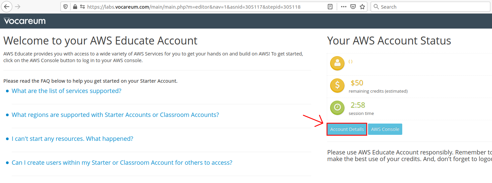

# Aims of the project

This project aims to use data science tools to analyse the [urticaria](https://en.wikipedia.org/wiki/Hives) desease.

# Getting started

The data that this is based on is not included in the repository. You would need a `CAPTUM` folder that contains pdfs that were downloaded from \[pubmed?!\].

If you are using conda, do the following, prior to running the notebook (also see [the docs](https://docs.conda.io/projects/conda/en/latest/user-guide/tasks/manage-environments.html#creating-an-environment-from-an-environment-yml-file)):

## Set up your conda environment

1. Create the environment from the `environment.yml` file:  
    ``` bash
    conda env create -f environment.yml
    ```
2. Activate the new environment:
    ``` bash
    conda activate urticaria
    ```
3. Verify that the new environment was installed correctly:
    ``` bash
    conda env list
    ```
    
## Update an existing conda environment

If you already have an existing conda environment, run the following script to update it with new dependencies.

``` bash
conda activate urticaria
conda env update -f environment.yml
```

# [AWS Textract](https://aws.amazon.com/textract/)

Textract is an Optical Character Recognition (OCR) service from Amazon.

## Create an `.env` file
You need an `.env` file that contains your AWS credentials. Create one and add the following environment variables:
```
REGION_NAME=<region>
AWS_ACCESS_KEY_ID=<key_id>
AWS_SECRET_ACCESS_KEY=<key> 
```
You can find your credentials here:  


# [AWS Textract](https://aws.amazon.com/textract/)
Textract is an Optical Character Recognition (OCR) service from Amazon.